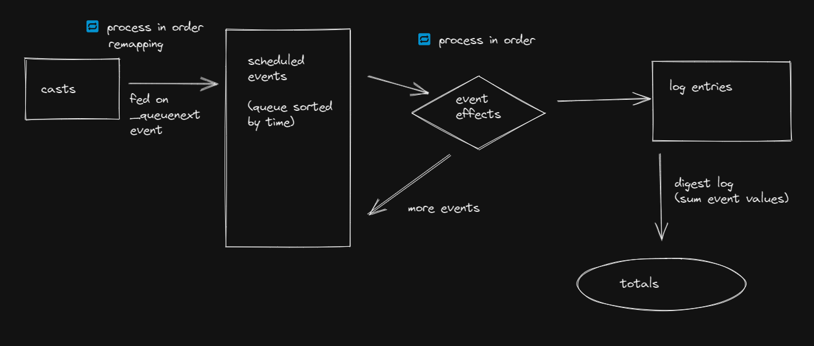

# ramp-calc

Simulates World of Warcraft's Discipline Priest's healing through combat simulation.

## How does it work

As this wasn't much planned the simulator is currently a bit of a mess.

But this is roughly the idea:

The main loop iterates over `scheduledEvents`. And events can generate new events, which I call "event effects".
